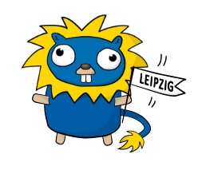
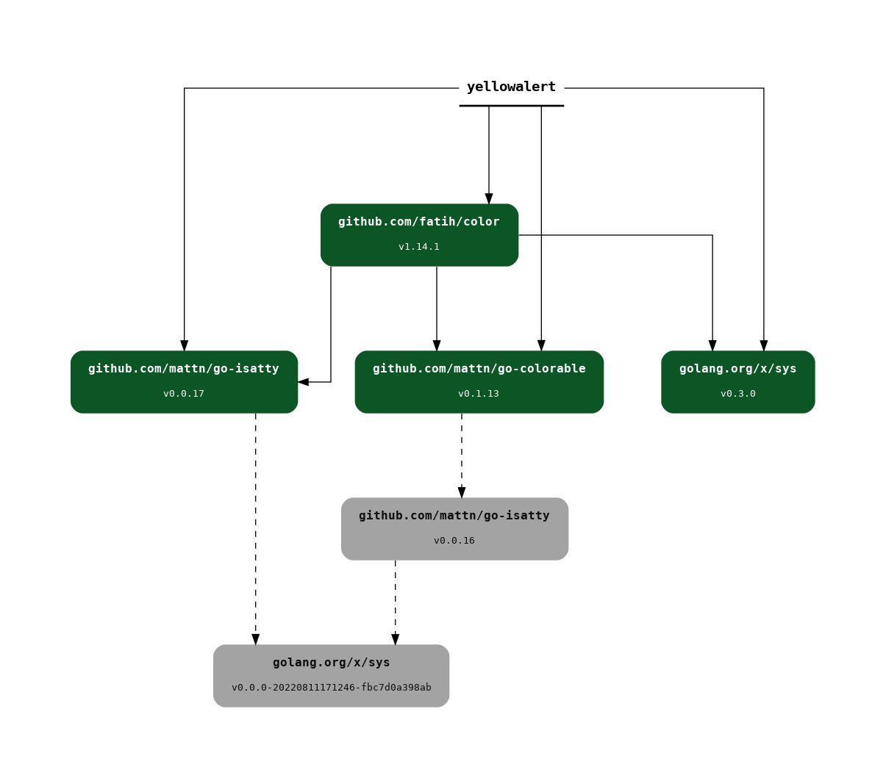

# Hello!

* open data engineer at [Internet Archive](https://archive.org), working on
  [scholar.archive.org](https://scholar.archive.org) and
[rclone](https://rclone.org/); software developer at [Leipzig
University Library](https://www.ub.uni-leipzig.de) on index metadata for
[libraries in Germany](https://finc.info/)
* learned about [Go](https://go.dev) in 11/2009 through Google Tech Talks, active user since 2013
* since 2019 co-host of [Leipzig Gophers Meetup](https://golangleipzig.space/)
* open source [contributions](https://github.com/miku), mostly "small tools"

---

# Leipzig Gophers

* *est. 2019*, [golangleipzig.space](https://golangleipzig.space)
* blog, 30+ (hybrid) events, [500+ members](http://meetup.com/leipzig-golang/)
* gave away tech books, Jetbrains subs, [Zimaboard](https://zimaboard.com), and more swag, ...

{height=100}

We talk about language features, libraries, cloud tools, databases and in the
past collaborated with interesting companies using Go, like [edgeless
systems](https://www.edgeless.systems/), [Gridfuse](https://gridfuse.com/),
[deta](https://deta.sh), [CodeNotary](https://codenotary.com/) and others.

Reach out!

---

# Overview

* sustainability, mostly as in **maintenance**

Sustainability refers to the capacity of a system to endure. -- [An Interview
Study on Sustainability Concerns in Software Development
Projects](https://ieeexplore.ieee.org/stamp/stamp.jsp?arnumber=8051370)

* security, as in **vulnerabilities**
* sustainability as in **resource efficiency**

---

# Motivation

* Go is a language and experiment on how to improve the software development process itself
* Go has inspired other ecosystems in the past (cf. [black](https://github.com/psf/black/), [sqlfmt](https://github.com/tconbeer/sqlfmt), ...)
* Maintenance is 90% of the software life cycle (...)

---

# Sustainability aspects

* stability
* dependencies

---

# Sustainability and Stability

* Go has a [Go 1 compatibility guarantee](https://go.dev/doc/go1compat)

It is intended that **programs written to the Go 1 specification will continue
to compile and run correctly, unchanged, over the lifetime of that
specification**.

Compatibility is at the **source level**.

---

# Readability counts

easier to maintain: mechanical changes to the source don't cause unrelated
changes to the file's formatting; diffs show only the real changes.

[](https://go.dev/blog/gofmt)

---

# Surviving Software Dependencies

[Surviving Software Dependencies](https://queue.acm.org/detail.cfm?id=3344149), Cox, 2019, [10.1145/3329781.3344149](https://doi.org/10.1145/3329781.3344149)

The Copay and Equifax ([2017 data
breach](https://en.wikipedia.org/wiki/2017_Equifax_data_breach) , Apache
Struts, financials details leaked, 148M profiles) attacks are clear warnings of
real problems in the way software dependencies are consumed today.

Various ways to cope with dependencies:

* test, isolate, avoid, upgrade

---

# Dependency management with Go modules

* Go did not have an own dependency management from the start (defered to third party tooling)
* reuse via URL-like import path, like `github.com/fatih/color`

Towards Go modules.

* Go modules first appeared in [Go 1.11](https://go.dev/doc/devel/release#go1.11) (2018-08-24) ([proposal](https://go.dev/blog/versioning-proposal))
* a Go module has a name and contains one or more packages
* since the beginning, Go had a decentralized approach, using URL-like import path

---

# Version control systems package repository

Package names are locators. A decentralized infrastructure. There is no
package *central*. There is an aggregation, however,
[pkg.go.dev](https://pkg.go.dev/).

```go
package main

import "github.com/fatih/color"

func main() {
    color.Yellow("alert")
}
```


---

# Go modules are the defacto standard

Relevant files are `go.mod` and `go.sum`, checked into version control. Both
are mostly edited by tools, e.g. `go mod ...`

```shell
$ ls -1
main.go  # your program
go.mod   # dependencies
go.sum   # checksums
```

No lockfile. Run `go mod tidy` and you're good.

---

# Example `go.mod`

The latest tag is used as version, but any commit id or pseudo-version would work. Indirect deps are transitive dependencies (included since Go 1.17).

```
module yellowalert

go 1.20

require github.com/fatih/color v1.14.1

require (
        github.com/mattn/go-colorable v0.1.13 // indirect
        github.com/mattn/go-isatty v0.0.17 // indirect
        golang.org/x/sys v0.3.0 // indirect
)
```

---

# Visually

Go loves tools.

```shell
$ go install github.com/lucasepe/modgv@latest
```

Generate a dependency graph from `go.mod`, e.g. via:

```shell
$ go mod graph | modgv | dot -Tpng > gomod.png
```

{ width=50% }

Also: [imgur.com/A9DP9P9.png](https://i.imgur.com/A9DP9P9.png)

---

# Example `go.sum`

Currently, SHA256 (h1) is used; hashes over files or trees. Not a lock file.

```
github.com/fatih/color v1.14.1 h1:qfhVLaG5s+nCROl1zJs...
github.com/fatih/color v1.14.1/go.mod h1:2oHN61fhTpgc...
...
```

Once a dependency has been fetched and its hash computed, it cannot be changed
without notice.

* flip a bit (e.g. git would allow us to move a tag, ...)

```shell
$ go mod verify
github.com/fatih/color v1.14.1:
    dir has been modified (...)
```

---

# Any domain works

Not tied to any source code host, or any domain for that matter.

```
$ go install golangleipzig.space/clt23@latest
```

Details: [CLT23](https://golangleipzig.space/clt23) - that site is run by a
static-site-generator and redirects to the actual repository.

---

# Leftpad!

Any problem ... can be solved by another level of indirection.

* [Go Module Proxy](https://go.dev/blog/module-mirror-launch), launched 2019-08-29

The `go` tool will ask [proxy.golang.org](https://proxy.golang.org) first, use
`GOPRIVATE="*"` to disable. Run your own proxy, if you run a company.

---

# Minimal Version Selection

An algorithm to resolve dependencies. Fast (not NP-complete), does not require lock files.

* choose minimal version required for any dependency
* depends on *import compatibility rule*

A human element required for any dependency management (e.g. we expect 1.2.3 be
compatible with 1.2.4, and we expect a v2 to be backwards incompatible) -
**import compatibility rule**: "If an old package and a new package have the same
import path, the new package must be backwards compatible with the old
package."

---

# MVS elsewhere

Other ecosystems are curious, e.g. cargo:

```
$ cargo -Z help | grep minimal-versions

    -Z minimal-versions -- Resolve minimal dependency versions instead of maximum
```

---

# Major Version Update

Go has a strict recommendation, when it comes to major version upgrades: you
should use a different name - e.g. a different import path, typically `.../v2`,
`.../v3`, ...

* github.com/my/module 1.0.0
* github.com/my/module/v2 2.0.0
* ...

---

# The story so far

* cannot change code, once required (and `go.sum` is checked in)
* very slim chance for **leftpad** (when using a proxy)
* very **fast** dependency resolution and high-fidelity builds
* with vendoring, we get **reproducible builds**

We can be aware of what goes into our binary.

---

# Security

* go tools: `go vet` and various linters
* third party tools, like [gosec](https://github.com/securego/gosec)
* since 09/2022: [govulncheck](https://pkg.go.dev/golang.org/x/vuln/cmd/govulncheck), [blog](https://go.dev/blog/vuln)

Separate tool, in testing phase.

> The new govulncheck command is a low-noise, reliable way for Go users to
> learn about known vulnerabilities that may affect their projects.

---

# OSV Format

[Open Source Vulnerability](https://ossf.github.io/osv-schema/) format, [osv.dev](https://osv.dev/)

> There are many problems to solve industry-wide concerning vulnerability
> detection, tracking, and response. One low-level problem is that there are
> many databases and no standard interchange format.

JSON schema, generic tools, like [osv-scanner](https://github.com/google/osv-scanner)

> OSV-Scanner parses lockfiles, SBOMs, and git directories to determine your
> project’s open source dependencies. These dependencies are matched against
> the OSV database via the OSV.dev API and known vulnerabilities are returned
> to you in the output.

---

# Flow


From: [blog/vuln](https://go.dev/blog/vuln)

---

# Example

An application, using Go 1.20.1 (after Go 1.20.2 has been released).

```
$ git clone git@github.com/miku/esbulk && cd esbulk
$ govulncheck ./...
...

Scanning your code and 148 packages across 6 dependent modules for known
vulnerabilities...
Your code is affected by 1 vulnerability from the Go standard library.

...
```

---

# Final bit: energy efficiency

* Paper on energy efficiency of programming languages: [Ranking Programming Languages by Energy Efficiency](https://haslab.github.io/SAFER/scp21.pdf) (2021)
* Go shines in category "lowest peak memory usage": [https://github.com/miku/goenergy#where-go-shines](https://github.com/miku/goenergy#where-go-shines)
* balance between performance and ease of use

Some anecdata.

* anecdata: a rewrite (of an internal project, written in a popular language) in Go used only 20% of the resources
* single data point: data web service, about 100 req/s sustained on commodity
  HW, simple web service on a 3W ARM (Dual-Core Cortex-A7 ARM CPU)
[cubietruck](https://linux-sunxi.org/Cubietech_Cubietruck) (2013) with similar
numbers

---

# Wrap up

* source code *compatibility guarantee*
* Go modules use *minimal version selection*, circumventing some potential issues stemming from the complexity of dependency management
* *distributed package management*, with central elements added for performance and reliability (proxy)
* balance between performance and ease of use

---

# Thanks

* Slides: [github.com/miku/goeco](https://github.com/miku/goeco)
* Leipzig Gophers: [golangleipzig.space](https://golangleipzig.space)
